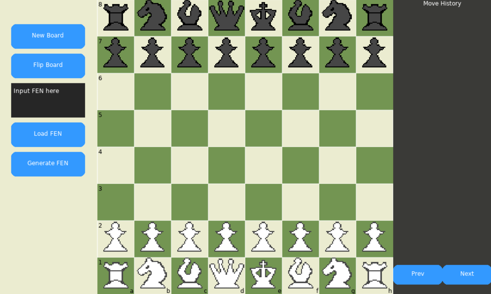

# Chess in Lua

Simple Chess game in the lua language using Love2d framework.

## What logic game has

The game has all the logic of chess + implementation of usage and generation of FEN(Forsyth-Edwards Notation) value, stored history of moves, ability to go to previous/next moves and flip board.

## What logic game still missing

1. Implementation of setting board by dragging/dropping pieces
2. Implementation of scoreboard
3. Implementation of time
4. Bot opponent

## Usage

For usage Love2D must be installed.
One can use executable Chess.love file or drag main.lua file into the Love's shortcut

Or alternatively visit https://lustrous-cajeta-768357.netlify.app/ where game is hosted using netlify and love.js.

## Screenshot

## Acknowledgments

* [Love2D](https://www.love2d.org/)
* [Love.js](https://github.com/Davidobot/love.js)
